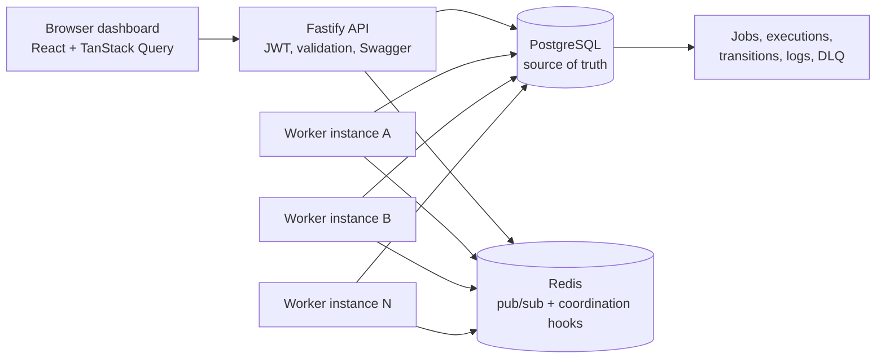

# Architecture

The API owns authentication, project/queue/job CRUD, validation, pagination, OpenAPI docs, and dashboard metrics. Workers are separate deployable processes. Each worker polls eligible queues, claims work inside a PostgreSQL transaction, runs jobs up to local and per-queue concurrency limits, heartbeats while executing, and writes execution history.

Critical path:

1. API creates a job in `queued` or `scheduled`.
2. Worker promotes due scheduled jobs.
3. Worker claims one eligible row with `SELECT ... FOR UPDATE SKIP LOCKED`.
4. Worker transitions `claimed -> running`.
5. Success writes `completed`; failure writes `failed`.
6. Retryable failure moves through `retrying -> scheduled`.
7. Exhausted failure moves to `dead` and creates a `dead_letter_queue` row.

Reliability properties:

- PostgreSQL row locks are the duplicate-execution guard.
- Queue `concurrency_limit` is checked before each claim.
- Stale worker/job heartbeats trigger crash recovery requeue.
- Lifecycle transitions are append-only audit records.
- Redis is used for event fan-out readiness, while the database remains authoritative.
