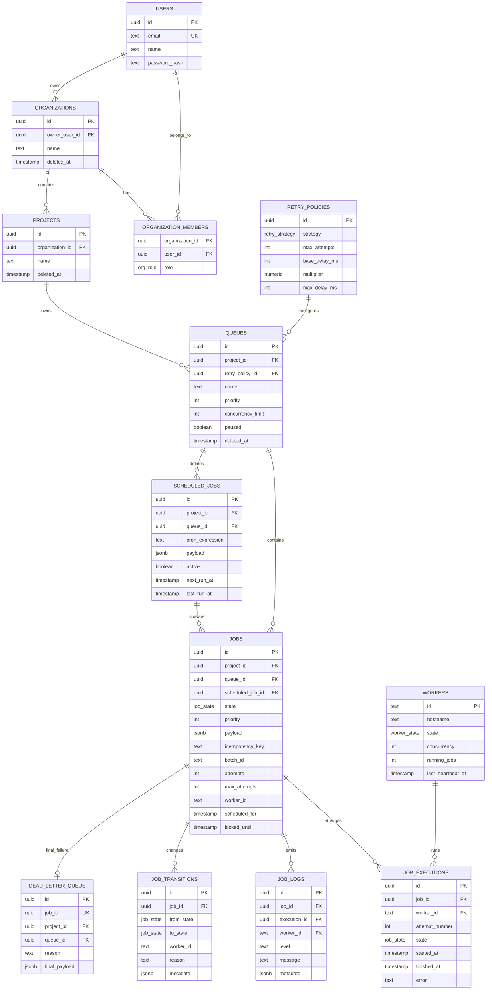

# ER Diagram

## Table Notes

- `users`: primary key `id`; unique `email`; password hash uses Argon2.
- `organizations`: `owner_user_id` restricts deletion while audit data exists; `deleted_at` supports soft deletion.
- `organization_members`: composite primary key prevents duplicate membership; cascades when a user/org is removed.
- `projects`: belongs to an organization; project deletion is soft-delete to preserve job audit data.
- `retry_policies`: referenced by queues; restricted deletion so historical queue configuration is not orphaned.
- `queues`: belongs to a project and retry policy; soft-delete; indexed by `project_id`, `paused`, and `priority`.
- `scheduled_jobs`: stores cron definitions separately from generated `jobs`; indexed by `active,next_run_at`.
- `jobs`: current job state and payload; hot claim index on `queue_id,state,scheduled_for,priority,created_at`; explorer index on `project_id,state,created_at`; partial unique idempotency key per project.
- `workers`: heartbeat state keyed by worker id; indexed by `last_heartbeat_at` for dead-worker detection.
- `job_executions`: one row per attempt; unique `job_id,attempt_number`; cascades with jobs.
- `job_logs`: per-execution log lines; indexed by `job_id,created_at`.
- `job_transitions`: append-only lifecycle history; indexed by `job_id,created_at`.
- `dead_letter_queue`: one row per terminal job failure; unique `job_id`; indexed for project/queue DLQ views.

Normalization is favored for auditability and access control. Deliberate denormalization exists on `jobs.max_attempts`, which snapshots retry behavior at job creation so future queue-policy edits do not silently change already-created work.
